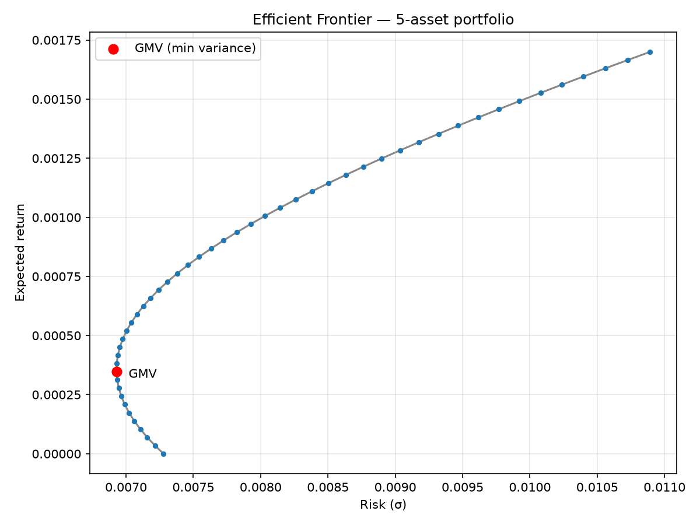

# Portfolio Optimization & Risk Engine

A mean-variance portfolio optimizer written from scratch in modern C++ — **including its own linear-algebra core, with no third-party numerical libraries**. Given a history of asset prices, it computes optimal portfolios (global-minimum-variance and target-return) and traces the efficient frontier.



*Efficient frontier for a five-asset portfolio (AAPL, JPM, XOM, PG, JNJ), computed by the engine. The red marker is the global-minimum-variance (GMV) portfolio, sitting at the frontier's left tip as theory requires. Axes are in daily terms.*

## What it does

- **Data pipeline** — loads a price CSV, computes daily simple returns, and estimates the sample covariance matrix Σ.
- **Linear-algebra core** — a `Matrix` class over a flat `std::vector<double>`, plus LU decomposition with forward/backward substitution to solve linear systems and invert matrices. No BLAS, no Eigen, no NumPy — every routine is hand-written and tested against hand-computed oracles.
- **Global Minimum Variance (GMV) optimizer** — solves for the lowest-risk portfolio, `w = Σ⁻¹1 / (1ᵀΣ⁻¹1)`, derived from Markowitz theory with a Lagrange multiplier.
- **Target-return optimizer** — the two-constraint mean-variance problem (budget + target return), solved as a 2×2 Lagrangian system.
- **Efficient frontier** — sweeps the target-return solver across a range of targets and emits the (risk, return) curve, exported to CSV and plotted in Python.

## How it works

The optimizers reduce to solving linear systems `Ax = b`, which the engine does via its own LU decomposition rather than a library call. Portfolio risk is the quadratic form `σ = √(wᵀΣw)`. The frontier is the locus of minimum-variance portfolios over all target returns; its left tip is the GMV portfolio, which serves as a built-in correctness check (see **Validation**).

The split is deliberate: **C++ computes, Python visualizes.** The engine writes `frontier.csv`; a small matplotlib script renders the chart.

## Build & run

Requires a C++20 compiler and CMake. The project was developed with CLion + Ninja on Windows, but builds with any standard toolchain.

```bash
# configure and build
cmake -S . -B build
cmake --build build

# run the demo (prints GMV + target-return portfolios, writes frontier.csv)
./build/engine

# run the verification suite
./build/tests

# plot the frontier (Python: pandas + matplotlib)
python plot_frontier.py
```

Two executables are produced: **`engine`** (the demo) and **`tests`** (the verification harness). Each has its own `main`, so they are separate CMake targets sharing the same source files.

### Regenerating the price data

`prices.csv` is included so the engine runs out of the box. To pull fresh data:

```bash
pip install yfinance pandas matplotlib
python pull_prices.py
```

## Validation

Numerical code is only as trustworthy as its tests. `tests.cpp` checks every component against a hand-computed oracle or a theoretical invariant:

- **LU solver** reproduces a hand-solved 3×3 system exactly.
- **Covariance matrix** is symmetric with a strictly positive diagonal.
- **Portfolio variance** agrees across two independent implementations (an explicit double sum and a matrix-multiply route) to within `1e-9`.
- **GMV and target-return portfolios** satisfy their constraints (weights sum to 1; target return achieved).
- **GMV is the global minimum** — no portfolio on the frontier has lower variance, and the frontier's minimum-variance point reproduces the GMV portfolio to four significant figures.

Every value comparison uses a tolerance, never floating-point `==`.

## Project structure

```
project/
├── Matrix.h / Matrix.cpp             # Matrix class + operators
├── DataLoader.h / DataLoader.cpp     # CSV loading, returns, covariance
├── LinearAlgebra.h / LinearAlgebra.cpp # LU solve, GMV, target-return, frontier
├── main.cpp                          # demo entry point (`engine` target)
├── tests.cpp                         # verification harness (`tests` target)
├── prices.csv                        # sample price history
├── pull_prices.py                    # data sourcing (yfinance)
├── plot_frontier.py                  # frontier chart (matplotlib)
└── frontier.png                      # rendered efficient frontier
```

## Roadmap

The engine is complete as a mean-variance optimizer through the efficient frontier. Planned extensions, not yet implemented:

- **Covariance shrinkage** (Ledoit–Wolf) — stabilizes the covariance estimate on noisy, short-history data, where classical Markowitz weights are notoriously unstable. Particularly relevant to sparse emerging-market data.
- **Monte Carlo Value at Risk** — Cholesky-factored correlated return simulation to estimate portfolio VaR at a chosen confidence level.

## Notes

The mathematics (Lagrangian derivations, the covariance quadratic form, LU decomposition) was worked through from first principles alongside the implementation. This is a learning project built to be correct and legible rather than fast, and to serve as a foundation for the extensions above.